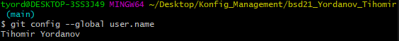
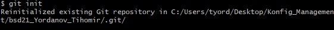
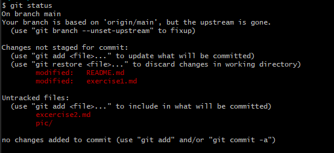
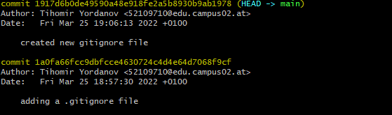
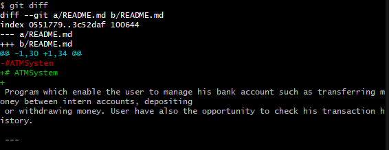

# Git Commands

Here is a list of some common Git Commands with simple description and example.  

For detailed information and more commands check [GIT CHEAT SHEET - GitHub Education](https://education.github.com/git-cheat-sheet-education.pdf)  

***

## git config  

* you can get or set local and global variables.  
    

## git init

* checks if there is a Git-Reposiroty on the path. It will be created an empry one if there in no existing one. Otherwise the repository will e reinitialized.  
    

## git commit

* save all the changes in the repository  
    

## git status

* shows all modified files from working directory and staging area. Files that contains extensions from .gitignore are not shown.  
    

## git add

* this command is used to add specific file from working directory to staging area.  
    

## git log

* shows list off all the commits logs including autor and date information.  
    

## git diff

* shows the diferences between files is 2 commits or between a commit and current repository.  
    

## git pull

* you fetch and download content from a remote repository and update the local repository with the changes.  
  

## git push

* upload the commits from local repository to a remote repository.  
  
