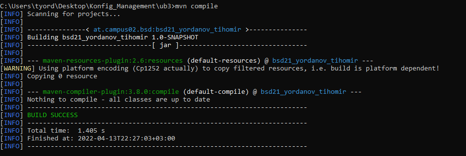

# Maven Project Structure and Git

In this exercise is created a Maven project, which uses the gitignore folder 
from last exercise.

***

## Creating and Settings 

After creation of the Maven project is set the git init and the content of last
exercise is cloned in this folder.

***

## Calculator

Implementation of Calculator and Main class. Calculator contains 4 different methods for 4 
different operations - addition, subtraction, multiplication and division.

The main method in the main class invokes every method of calculator class after
initialising it.

***

**To view all my works click** [**HERE**](README.md)