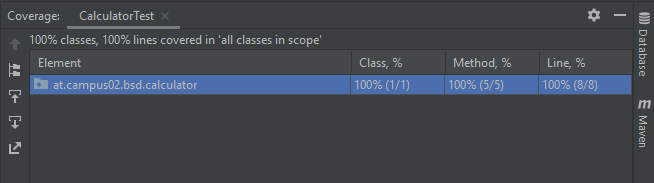

# JUnit

I extended my Maven Project in this exercise with some text cases checking if 
all the methods give correct return values
***

I created minimum 2 different test outputs for each method and for each output 
I made 2 different options for control:  

- once with prepared result
- once with same result but this time computed from Java

>**CASE DIVISION:** There is an additional test which checks if the return value is 0  
> In this case the return value is set to 0 but on the console is printed "Division by 0 is not possible!"

***

## Coverage

On the picture is shown that with this test cases I get 100% coverage.

