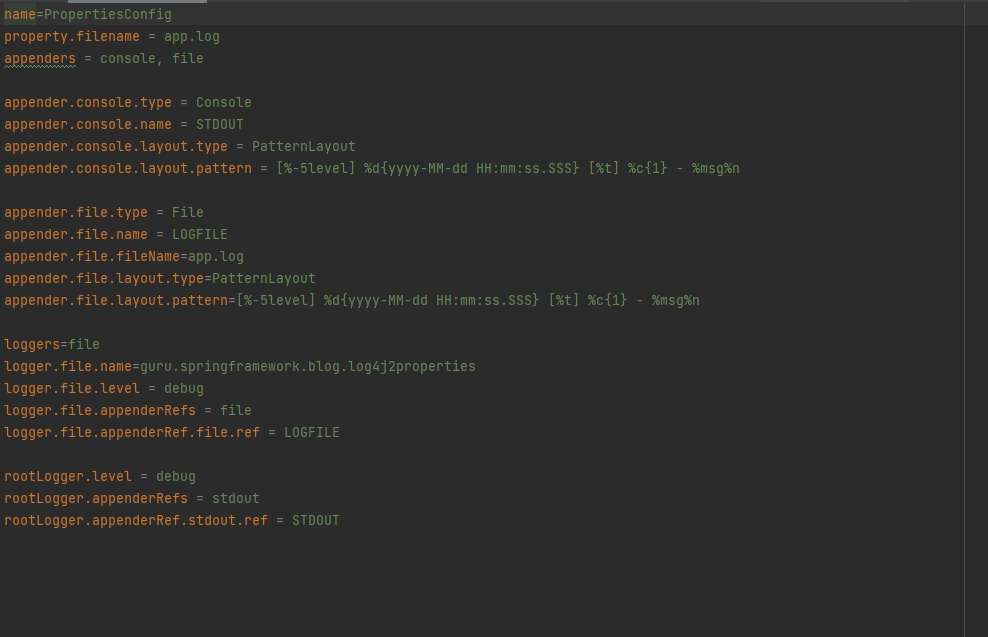

#Logging 

We use logging to trace out errors of the applications. Log messages 
are printed on the console or in a file where the developers easy could check them out 
and fix them.

***

There are 5 levels in Log4j 
* Debug: providing additional information to an application developer
* Info: gives the progress and chosen state information
* Warn: warning about an unexpected event to the user
* Error: gives information about a serious error which may result in unstable state
* Fatal: indicates application death
* All: used to turn on all levels of logging
* Off: opposite to ALL level

***

Log4J is a convenient way to track my application for any error and for the right output.

***

## Problems with XML-file 
The custom xml file for log configuration is not read in any place of the maven project, 
so I decided to configure it with a *.properties file which makes everything correct but
at the end only create the log folder where the output should be placed. The console output 
is correct.

[**Return to README**](README.md)